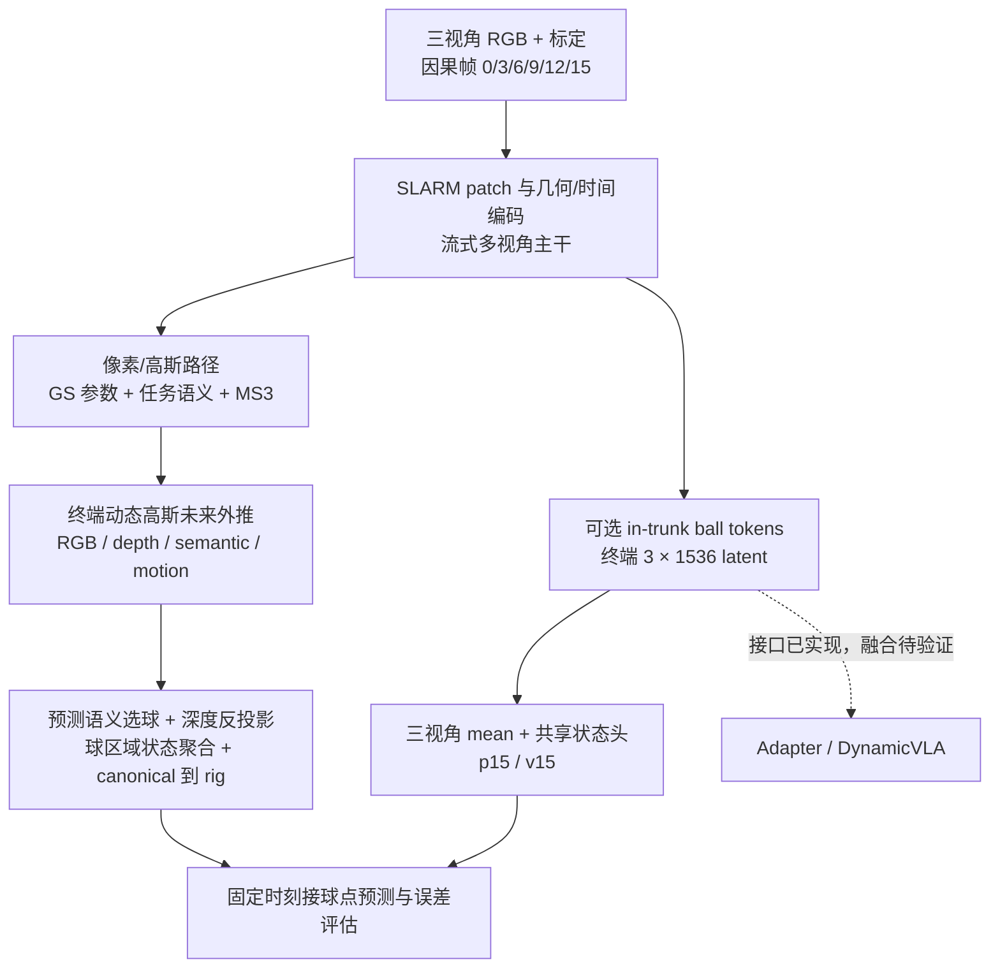

# 从动态重建到网球接球：SLARM 任务化改造与实验总结

汇报日期：2026-09-17。代码基准：本地 `4f7e46a` 及检查时工作区；实验数值来自项目文档与用户提供的服务器报告，未在本机重跑。配套演示文稿：`TENNIS_PROJECT_REPORT_codex.pptx`。

更新：最新训练 checkpoint 为 `ckpt_019999`。本文已列出的 10k 精度仍属于 `ckpt_013999`，不能直接替换 checkpoint 名称；019999 的同口径评测结果待补。最新不等于最优，需扫描 checkpoint 后再选最终模型。

## 1. 汇报摘要

本项目基于开源 SLARM，将通用动态场景重建模型改造成面向三视角网球接球的感知与预测系统。主要贡献是：建立固定因果观测协议；使终端动态高斯承担未来外推；以球区域几何、任务语义和物理运动监督强化小目标；提供像素路径与紧凑 ball-token 状态/特征接口；构建从重建精度到固定接球时刻误差的诊断体系。

**推荐汇报表述：面向高速小目标接球的系统性算法改造与验证，而不是宣称发明 SLARM、3DGS、流式 Transformer 或新的基础物理模型。**

当前实用主线为 pixel/MS3 路径；ball-token 是已实现的对象级表征探索，尚未证明优于像素路径。新 10k 数据微调的 ckpt13999 报告 frame24 误差 4.1/11.2 cm、固定接球时刻误差 7.0/17.4 cm（median/p95）。这些是当前候选结果，不是无条件可归因的增益，也不等同机器人闭环接球成功率。

## 2. 继承与新增的边界

上游 [SLARM 官方仓库](https://github.com/kevinchiu19/SLARM) 提供前馈动态重建、流式推理、3D Gaussian 与运动联合预测以及语言对齐相关能力。本项目保留其主干思想，重点改变任务协议、外推时序归属、监督与任务读出。上游说明核对于 2026-09-17；本文不是对上游所有版本逐行差异的穷尽审计。

| 层次 | 继承的基础 | 本项目改造 | 状态 |
| --- | --- | --- | --- |
| 表征主干 | 图像 patch、多视角聚合、流式状态、GS/运动输出 | 三视角、6 个因果时刻的接球协议 | 已实现 |
| 时间预测 | 动态重建与运动推进 | 终端动态高斯未来归属，解除末观测后的渲染限制 | 已实现、配置启用 |
| 监督 | 重建与运动学习框架 | 球区域 RGB/米制深度尾部、任务语义、球/静态 MS3 分离 | 已实现 |
| 语义 | LSeg/语言对齐能力 | 关闭 LSeg 特征监督，使用四类任务语义 | 当前配置启用 |
| 对象读出 | 主干 latent | in-trunk ball token、状态头、轨迹/接球点损失、latent 导出 | 已实现、精度收益未证明 |
| 运动修正 | baseline 状态 | 冻结模型的历史 latent 差分残差速度头 | 已实现、当前实验收益有限 |
| 验证 | 重建质量指标 | 接球时刻、视线误差、融合/物理/历史拟合消融 | 已实现 |
| 策略控制 | 无本项目融合闭环证据 | 为 DynamicVLA 提供对象 latent 接口 | 接口已具备，融合待验证 |

## 3. 总体架构



两条路径是可配置分支，不能将所有实验模块描述为当前主模型同时启用。10k pixel-only 配置关闭 ball-token、temporal refiner 和 velocity residual。

## 4. 贡献一：由动态重建转向因果未来预测

**问题：** 接球决策发生在未来观测到来前，只有重建已观测时刻不够。

**实现：** 采用 `[0,3,6,9,12,15]` 六次因果观测；通过 `terminal_context_extrapolation` 让终端高斯承担终端及后续目标的时间归属，清除更早高斯在该区域的重叠时间归属。动态高斯按 MS3 位移推进，静态部分不使用动态终端位移。

在默认窗口中，frame15 到 frame24 为 0.3 秒；到固定 frame45 为 1 秒。后者在现有仅保存到 frame24 的数据上使用解析弹道参考，不是新增的视频标注。

**贡献边界：** 新增的是任务化的终端外推和因果评测组织，不是首次提出动态高斯或 Taylor 运动模型。

代码：`src/models/slarm.py::forward_renderer`、`src/models/temporal_ownership.py`、`src/models/stream_session.py`。

## 5. 贡献二：小目标优先的几何与物理监督

网球仅占少量像素，全图 RGB 很好不代表球位置和速度准确。项目将监督拆成全局重建与球区域专用目标：

- 全局 RGB/LPIPS、相对深度、任务语义和 opacity。
- 球区域 RGB 与米制深度误差；深度同时考虑均值及高误差尾部。
- 球区域 MS3 的速度、加速度、jerk；静态区域单独采样和监督。
- 标定、反投影、canonical/rig 变换统一后，使用物理单位计算球状态和外推。

运动表达为 `p(t+dt)=p+v*dt+0.5*a*dt²+j*dt³/6`。训练的球运动 GT 含重力与零 jerk。另有 `ms3_physics_override` 可选硬覆盖：动态目标 a=g、j=0；**当前 10k 配置未显式开启该选项，不能宣称当前像素模型始终硬编码重力。** ball-token 轨迹/接球点路径则使用已知重力积分。

默认球速度的误差尺度与 MS3 的尺度不是同一参数：`stream25_ball_vel_scale` 只作用于 token 速度 loss 归一化；不改变 decoder 的物理 m/s 输出。物理先验的作用是约束与诊断，已有报告中 learned MS3 与重力外推接近，不能将全部收益归因于硬物理覆盖。

代码：`src/utils/stream25_losses.py`、`src/dataset/stream25.py::build_dense_ms3_gt`、`src/models/slarm.py::_apply_physics_ms3_override`。

## 6. 贡献三：任务语义替代 LSeg 特征监督

当前训练配置将 `online_feat`、`enable_feat_loss` 关闭，`stream25_lseg_feature_weight=0`，启用四类 `task_semantic` 头。预测的球语义为像素路径提供选球区域，并与 GS 渲染输出对齐。

这是面向封闭接球场景的任务化简化，不是“删除所有语义”，也不是保留原样的开放词汇能力。代码仍可能保留兼容路径，不应说整个仓库完全没有 LSeg。依赖与监督负担的减少有实现依据；没有统一延迟/显存对照，因此不报告未经测量的加速比例。

代码：`configs/exp0915_001_slarm_stream25_0908_10k_pixel_finetune.yml`、`src/models/slarm.py::forward_task_semantic_predictor`。

## 7. 贡献四：对象级 Ball Token 与任务对齐监督

in-trunk token 参与主干 attention，而不只是主干完成后的外挂探针。终端导出三目 latent `[B,3,1536]`，共享状态头对三目均值输出 `p15/v15`，为显式状态和下游特征消费提供两个接口。

```text
图像 patches + ball token → 主干 attention → 三目终端 latent
                                      ├→ mean → MLP → p15, v15
                                      └→ 保留三目 latent → 下游 adapter（待验证）
```

监督包含位置、速度，以及启用时的重力轨迹和固定接球时刻损失。轨迹多点监督改变优化约束，但解析轨迹不产生新的独立观测。三目 token 已在主干中交换信息，不是独立单目状态；原 pooled baseline 也没有每目独立一致性 loss。

004 的逐目位置、历史 patch refiner、prefix 监督属于可选实验。最新主线并未将这些模块全开。对象 latent 的质量必须通过冻结特征探针、下游任务收益等验证，不能仅以 attention 高亮或低训练误差证明。

代码：`src/models/components/aggregator/aggregator.py`、`src/models/slarm.py`；接口说明：`BALL_LATENT_EXPORT.md`。

## 8. 贡献五：冻结基线的历史运动残差实验

006/008/009/010 在原 ball-token baseline007999 上训练新增头，不以004初始化，也不叠加004 refiner。

```text
6个真实历史 latent → valid-view mean → 共享1536→256投影 → LayerNorm
每帧 [h_t, h_terminal-h_t, dt_seconds, valid_bit]
→ 六帧拼接3084 → 512 → 256 → 3 → Δv
v_final = stopgrad(v_base) + Δv
```

末层零初始化；仅训练新增头；invalid feature 显式置零；不加 prefix 监督；速度修正以物理 m/s 相加。010 配置使用 terminal velocity、trajectory、landing 与轻微 Δv L2 正则，position/pixel/world-model 基线冻结。

当前010报告的验证速度约0.101/0.268 m/s，与 baseline0.102/0.269接近；训练修正幅度仅约0.002 m/s。应汇报为受控的表征可读性探索，**不作为已经成功的精度创新点**。小修正也不足以证明 latent 中完全没有运动信息。

代码：`src/models/ball_velocity_residual.py`、`src/utils/ball_residual_checkpoint.py`、`src/utils/ball_residual_diagnostics.py`。

## 9. 实验结果与可信边界

| 实验/数据口径 | frame24 med/p95 (m) | catch med/p95 (m) | velocity med/p95 (m/s) |
| --- | --- | --- | --- |
| 旧 pixel019999，训练集200条 | 0.027 / 0.055 | 0.038 / 0.081 | 0.034 / 0.085（MS3） |
| 旧 pixel019999，验证集100条 | 0.052 / 0.139 | 0.108 / 0.252 | 0.098 / 0.211（MS3） |
| 10k微调13999，用户报告，offset0 | 0.041 / 0.112 | 0.070 / 0.174 | 0.067 / 0.185（MS3） |
| offset+3验证200条，checkpoint配对待确认 | 0.154 / 0.253 | 0.665 / 0.924 | 0.688 / 0.873（MS3） |

10k报告的 validation manifest、样本数和旧数据是否一致仍需运行记录确认。因此上述行不能直接作为同分布对照计算“提升百分比”。报告的 frame24 仍采用未补偿球前表面与球心的历史口径。catch 是固定时刻位置距离，并不自动等同球落地、穿过接球平面或闭环捕获。

后续用户补充：013999 的 catch 中位为 0.0696 m，报告成功率 67.5%，区间 [60.7%, 73.6%]，n=200。该成功判据及区间方法需与 `report_catch.py` 对齐后再放入正式PPT；不能将它未经确认地称为机器人闭环成功率。比较同一批场景上的 checkpoint 应使用配对统计，不能把“必须提升10个百分点”或“连续四次上升”作为通用显著性标准。

| 对象分支，旧数据100条报告 | frame24 med/p95 (m) | p15 med/p95 (m) | v15 med/p95 (m/s) |
| --- | --- | --- | --- |
| ball-token baseline007999 | 0.0613 / 0.1556 | 0.0347 / 0.0826 | 0.1022 / 0.2693 |
| 004 ckpt003999 | 0.0615 / 0.1585 | 0.0365 / 0.0853 | 0.1074 / 0.2701 |

已得到的重要负结果：逐目预测位置再平均没有胜过 feature mean；004 历史位置拟合速度0.1465 m/s劣于原头0.1074；其frame45中位误差由0.1319增至0.1699 m。拟合不作为默认部署方案。

`EXPERIMENTS_AND_ERROR_BUDGET.md` 中“达到几何极限”和“滑窗免费提升”属于已失效或未经验证的旧推断，不能用于最终汇报结论。训练/验证差距提示泛化问题；offset结果也不支持无需训练即可平移窗口。

## 10. 工程验证也是项目贡献

已建立像素/ball-token双路径对照、free/physics/linear外推、融合读出、历史拟合、视线/横向误差、时间单位与坐标检查、缺样本诊断，以及 GS PLY / token attention 可视化工具。

GS 视频展示场景与预测球的几何演化；attention图展示 token 与图像证据的联系。二者可用于解释模型，但注意力不是因果解释、PLY也不等同重建精度证明。配套PPT采用可编辑流程图和来源明确的结果表，不伪造推理截图。

## 11. 下一阶段

1. 固定同一验证 manifest，补齐旧模型与13999的同场景对照和接球距离 hit rate。
2. 检查同一绝对帧在不同窗口的 MS3 输出，再开展随机窗口起点微调；详见 `RANDOM_WINDOW_FINETUNE_codex.md`，该方案尚未实现。
3. 用状态/球位置等冻结特征探针验证 latent 可读性，再进行 DynamicVLA adapter 与策略训练；不预先宣称接 action expert 或经原语言模型的方案已胜出。
4. 在更长视频或真实标注上验证长时预测，最终加入延迟、控制与机器人闭环成功率。

## 12. 一分钟汇报稿

“我们基于开源 SLARM，把通用动态重建改造成面向网球接球的因果感知与预测系统。第一，增加终端高斯的未来外推机制；第二，针对小球引入局部几何、任务语义和物理运动监督，并关闭不需要的 LSeg 特征监督；第三，构建像素状态读出与对象级 ball-token 接口，为后续策略模型提供状态和特征。当前10k微调候选报告固定接球时刻7厘米中位误差，但长尾与滑动窗口泛化仍是主要挑战。我们通过消融确认，增加token时序模块并未稳定超过像素路径，因此后续优先改善数据覆盖和窗口泛化，再验证下游策略收益。”

## 13. 复现与材料

- 上游归属：[SLARM](https://github.com/kevinchiu19/SLARM)。
- 主路径配置：`configs/exp0915_001_slarm_stream25_0908_10k_pixel_finetune.yml`。
- 对象基线配置：`configs/exp0908_003_slarm_stream25_0903_2k_balltoken_intrunk_landing.yml`。
- 残差实验配置：`configs/exp0911_010_balltoken_history_concat_deltat_diff_regularized.yml`。
- PPT生成脚本：`tools/build_tennis_project_report.py`，运行 `python3 tools/build_tennis_project_report.py`，需要 `python-pptx`。
- PPT包含逐页讲稿备注与代码/实验来源；实际训练结果以服务器原始JSON和启动命令为准。
